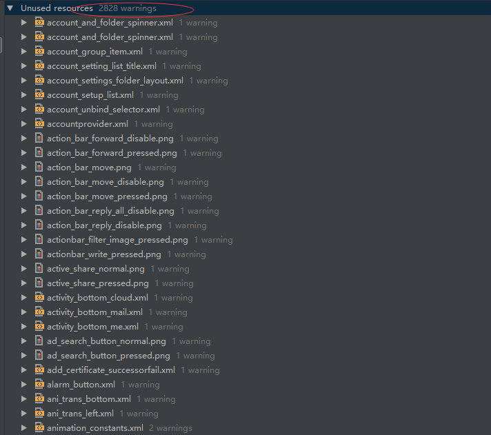

## 缩小Apk大小
### 可以缩减的方向
1. 无用的资源
2. 没有引用的声明
3. 重复定义的常量，空的方法，可以精简的代码
### 目前项目中的无用资源以及没有引用的声明的大概情况
#### 无用资源（各种xml，图片）

#### 没有引用的声明

##### 无直接引用的类

##### 最终可能还是没有使用到的类

##### 方法属性

#### 重复定义的常量，空的方法，可以精简的代码

### 粗略情况下Debug包启用lint与未启用的大小对比
#### 未启用lint

#### 启用lint

#### lint 可以cover到的问题
1. 去除无引用资源
2. 去除无引用类
### 启用lint需要启用混淆
#### 关于启用混淆可能带来的问题
##### 编译时间的加长
单次打包的时间分析：
未启用Proguard ：

启用Proguard：

添加混淆过后的单次打包延长一分钟左右。
其中资源的shrink时间可以通过删除无用资源来减少
并且，在shrink后的apk中，无用的资源文件并不会直接移除，而是压缩成体积很小的文件，所以还是建议手动删除无用资源
##### 需要添加混淆的代码遗漏
笼统的添加会keep住许多可以混淆的代码
出现安全性问题的话，重新去添加混淆会比较难查到问题
##### 不需要添加混淆的代码添加混淆后出错
1. 不需要添加混淆的代码
    * 所有按照名称parse过来的bean，ep json
    * 所有使用了反射获取的代码
    * 部分三方的类库使用了的代码
    * 所有的jni调用代码
2. 出现的问题
    * 崩溃
    * catch住崩溃的导致功能不可用
    * 以及的动态配置的资源而被lint检查删除 （可以单独配置不处理）