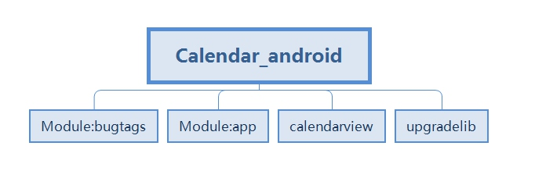
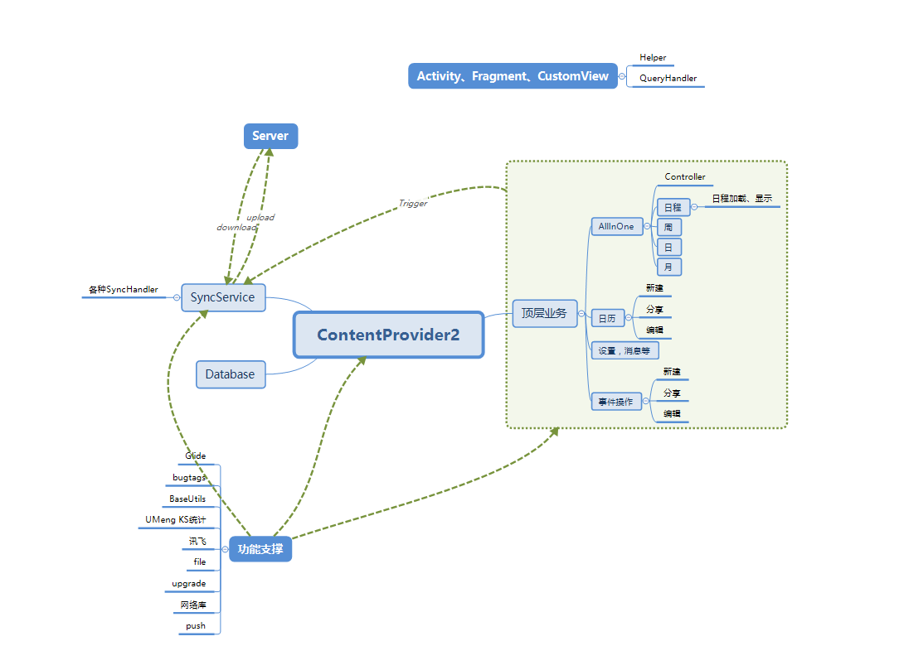
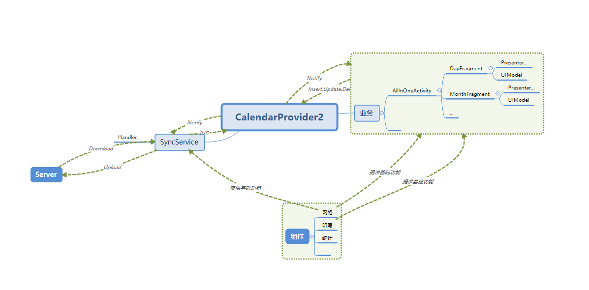

#Android项目组件化
##目前WPSCalendar Android客户端
###代码结构

其中，app模块为主要模块，包含大量功能，因为历史原因很多类都有重复功能或者就是完全的拷贝分别在com.android包以及com.kingsoft.calendar包下。
其中kingsoft包的划分主要依据类的类型，例如adapter、model、service，还有一些以功能划分的zxing、speechlib、filemanager，还有临时开的一些包swipe、resultbean等。
###业务结构

主要的业务功能为AllInOneActivity中的各种视图，以及对事件的操作，和对日历的操作，这些操作都是由ContentProvider提供的数据支撑，而在SyncService提供对本地与服务端的数据交互，功能支撑部分是整个业务的基础能力，与具体业务无关。
而我们的上层业务的层次并不统一，有Activity承载所有展示以及业务，也有Activity+Fragment承载所有业务与展示，也有CustomView承载所有。
##希望对代码结构以及业务结构的一些整理
###基于业务逻辑的组件化调整
1. 建议使用MVP模式 View层次采用Activity+Fragment，单纯的Activity来展示，不利于界面的重用。
2. 断离掉业务逻辑与SyncService的链接
3. 将功能支撑部分由功能拆成单独的module

调整之后：

每个基础功能做成单独的组件，通过接口给主模块提供功能
代码分包建议以功能分包，便于以后项目的插件化

好处：
1. 组件的内部功能修改不影响业务逻辑
2. 组件可重用，可自由拆除
3. 使用Fragment作为View，这样当业务调整的时候可以让Fragment重用而无需移动整个Activity
4. 使用MVP把展示与业务拆分，无论是界面修改还是业务修改都不会相互影响
5. 业务层次把ContentProvider作为数据来源，无需去顾及数据的上下行逻辑，业务层次与数据逻辑解耦
6. Provider提供数据详细操作，维护上下行数据的合法性

